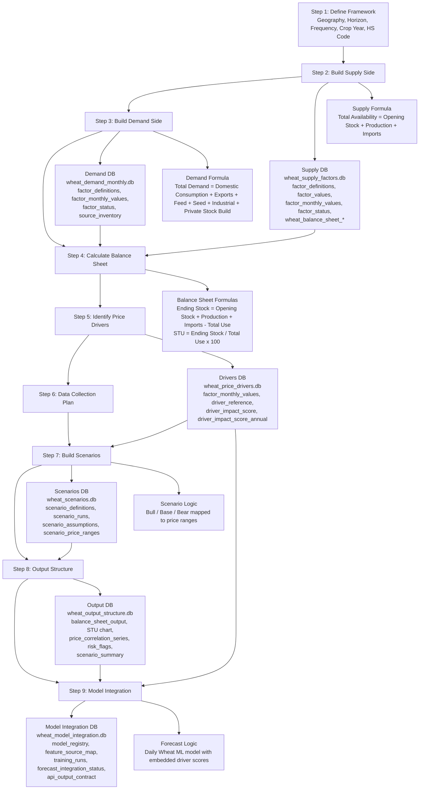

# Wheat Supply Blueprint

This document captures the validated Step 2 Wheat supply structure from the local S&D build.

## Step 1 To Step 9 Flow

## Supply DB

- DB: [wheat_supply_factors.db](D:/ncel2/ncel-commodity-pricing/SnD/supply/wheat/wheat_supply_factors.db)
- Builder: [build_wheat_supply_store.py](D:/ncel2/ncel-commodity-pricing/SnD/supply/wheat/build_wheat_supply_store.py)

# Step 2 — 6W Commodity Profile

DB:

- [wheat_6w_profile.db](D:/ncel2/ncel-commodity-pricing/SnD/profile/wheat/wheat_6w_profile.db)

Builder:

- [build_wheat_6w_profile.py](D:/ncel2/ncel-commodity-pricing/SnD/profile/wheat/build_wheat_6w_profile.py)

Purpose:

- build the foundational Wheat context layer across the document's six dimensions:
  - `Where`
  - `What`
  - `When`
  - `How Much`
  - `Why`
  - `Whom`

## Step 2 Tables

| Table | Purpose |
|---|---|
| `source_inventory` | source register for the profile layer |
| `commodity_master` | single-commodity Wheat master row |
| `hs_code_register` | Wheat HS code reference |
| `crop_year_calendar` | Wheat crop-year and market-stage calendar |
| `six_w_output` | 6W output table aligned to the document |
| `national_trend_10y` | 10-year national Wheat area, production, yield, and procurement trend |
| `state_production_map` | core-state production map and role summary |
| `harvest_calendar` | state-level harvest / arrivals / procurement calendar |
| `key_player_register` | key institutions and market actors |

## Step 2 Current Counts

| Table | Rows |
|---|---:|
| `source_inventory` | `4` |
| `commodity_master` | `1` |
| `hs_code_register` | `1` |
| `crop_year_calendar` | `6` |
| `six_w_output` | `6` |
| `national_trend_10y` | `24` |
| `state_production_map` | `4` |
| `harvest_calendar` | `16` |
| `key_player_register` | `5` |

## Step 2 6W Output

| Dimension | Item Label | Item Value |
|---|---|---|
| `Where` | `Core wheat states` | `Punjab; Haryana; Uttar Pradesh; Madhya Pradesh` |
| `What` | `Grades and varieties` | `Milling wheat; feed wheat; Sharbati wheat; standard FAQ wheat` |
| `When` | `Season timeline` | `Harvest -> mandi arrivals -> procurement -> port shipment` |
| `How Much` | `10-year metrics backbone` | `Area (Mha), production (MnT), yield (kg/ha), procurement (LMT)` |
| `Why` | `Key price drivers` | `MSP linkage; procurement intensity; winter temperature and frost; export policy; Black Sea disruption` |
| `Whom` | `Key institutions and market actors` | `FCI; state procurement agencies; flour millers; cooperative exporters; private traders` |

## Step 2 Summary

- Step 2 is now implemented for Wheat
- it uses existing Wheat support data for the national 10-year trend backbone
- state map, harvest calendar, and key player register are curated to match the document's profile layer

## Main Monthly Supply Table

Table: `factor_monthly_values`

Schema:

| Column | Type |
|---|---|
| `id` | `TEXT` |
| `factor_key` | `TEXT` |
| `metric_month` | `TEXT` |
| `marketing_year` | `TEXT` |
| `geography` | `TEXT` |
| `value` | `REAL` |
| `unit` | `TEXT` |
| `source_name` | `TEXT` |
| `source_url` | `TEXT` |
| `method` | `TEXT` |
| `confidence` | `TEXT` |
| `notes` | `TEXT` |
| `updated_at` | `TEXT` |

## Supply Factors

| Factor | Group | Monthly Status | Data From | Data To | Rows | Source | Method |
|---|---|---|---|---|---:|---|---|
| `Acreage (sown area)` | `area` | `annual_only` | `2016-04-01` | `2026-03-01` | `120` | `Economic Survey Statistical Appendix` | `annual_area_hold_constant_monthly` |
| `Yield per hectare` | `yield` | `annual_only` | `2016-04-01` | `2026-03-01` | `120` | `Economic Survey Statistical Appendix` | `annual_yield_hold_constant_monthly` |
| `Domestic production` | `production` | `annual_only` | `2016-04-01` | `2026-03-01` | `120` | `Economic Survey Statistical Appendix` | `annual_production_to_monthly_harvest_release_proxy` |
| `Opening stocks` | `stock` | `mixed` | `2016-04-01` | `2026-03-01` | `120` | `USDA Grain Circular, DFPD Foodgrains Bulletin` | `annual_opening_to_ending_stock_interpolation, dfpd_monthly_central_pool_stock` |
| `Imports` | `trade` | `available` | `2016-04-01` | `2026-03-01` | `120` | `USDA GAIN 2017, USDA GAIN 2019, DGCI&S TradeStat` | `supply_store_from_tradestat_monthly_total_hs1001, fallback supply_store_from_annual_imports_to_monthly_proxy` |
| `Buffer stock` | `stock` | `mixed` | `2016-04-01` | `2026-03-01` | `120` | `USDA Grain Circular, DFPD Foodgrains Bulletin` | `annual_opening_to_ending_stock_interpolation, dfpd_monthly_central_pool_stock` |
| `USDA global production by country` | `global_production` | `partial` | `2016-04-01` | `2026-03-01` | `1200` | `USDA WASDE March 2026 XML` | `usda_wasde_marketing_year_hold_constant_monthly, older backfilled_from_2023_24_usda_snapshot` |
| `Major producer crop conditions` | `crop_condition` | `curated` | `2016-04-01` | `2026-03-01` | `840` | `curated global crop-condition profile` | `recurring_monthly_crop_condition_profile` |
| `Southern Hemisphere harvest calendar` | `calendar` | `curated` | `2016-04-01` | `2026-03-01` | `240` | `curated Southern Hemisphere wheat harvest calendar` | `recurring_monthly_harvest_calendar` |
| `Total demand monthly` | `demand` | `derived` | `2016-04-01` | `2026-03-01` | `120` | `USDA GAIN 2017, USDA GAIN 2019, USDA GAIN 2021, USDA Grain Circular 2026` | `supply_store_from_domestic_consumption_plus_exports_plus_feed_plus_seed_plus_industrial_plus_private_stock_build` |
| `Total availability` | `derived` | `derived` | `2016-04-01` | `2026-03-01` | `120` | `derived inside supply store` | `opening_stock_plus_domestic_production_plus_imports` |
| `Delta` | `derived_balance` | `derived` | `2016-04-01` | `2026-03-01` | `120` | `derived inside supply store` | `total_availability_minus_total_demand_monthly` |

## Step 2 Data Inventory Audit

Note:

- in the table below, `Source` and `Link to source` reflect the earliest stored source row for that series in `factor_monthly_values`
- some series use a broader source chain across later years, but this table is intentionally row-level and DB-faithful

| Data name | Source | Source type | Monthly Status | Data From | Data To | Rows | Link to source | DB name | Table name | First 10 rows |
|---|---|---|---|---|---|---:|---|---|---|---|
| `Acreage (sown area)` | `Economic Survey Statistical Appendix` | `pdf` | `annual_only` | `2016-04-01` | `2026-03-01` | `120` | [source](https://www.indiabudget.gov.in/economicsurvey/doc/Statistical-Appendix-in-English.pdf) | `wheat_supply_factors.db` | `factor_monthly_values` | `2016-04-01=30.8; 2016-05-01=30.8; 2016-06-01=30.8; 2016-07-01=30.8; 2016-08-01=30.8; 2016-09-01=30.8; 2016-10-01=30.8; 2016-11-01=30.8; 2016-12-01=30.8; 2017-01-01=30.8` |
| `Buffer stock` | `USDA annual wheat balance + interpolation` | `pdf` | `mixed` | `2016-04-01` | `2026-03-01` | `120` | [source](https://apps.fas.usda.gov/psdonline/circulars/grain.pdf) | `wheat_supply_factors.db` | `factor_monthly_values` | `2016-04-01=3.04; 2016-05-01=3.654545; 2016-06-01=4.269091; 2016-07-01=4.883636; 2016-08-01=5.498182; 2016-09-01=6.112727; 2016-10-01=6.727273; 2016-11-01=7.341818; 2016-12-01=7.956364; 2017-01-01=8.570909` |
| `Delta` | `Derived inside wheat supply store` | `derived/local` | `derived` | `2016-04-01` | `2026-03-01` | `120` | — | `wheat_supply_factors.db` | `factor_monthly_values` | `2016-04-01=40.393426; 2016-05-01=26.630268; 2016-06-01=9.730414; 2016-07-01=3.57335; 2016-08-01=1.187184; 2016-09-01=-0.174908; 2016-10-01=-1.270085; 2016-11-01=-0.971955; 2016-12-01=-0.589514; 2017-01-01=0.280834` |
| `Domestic production` | `Economic Survey Statistical Appendix` | `pdf` | `annual_only` | `2016-04-01` | `2026-03-01` | `120` | [source](https://www.indiabudget.gov.in/economicsurvey/doc/Statistical-Appendix-in-English.pdf) | `wheat_supply_factors.db` | `factor_monthly_values` | `2016-04-01=45.31; 2016-05-01=30.535; 2016-06-01=12.805; 2016-07-01=5.91; 2016-08-01=2.955; 2016-09-01=0.985; 2016-10-01=0.0; 2016-11-01=0.0; 2016-12-01=0.0; 2017-01-01=0.0` |
| `Imports` | `USDA GAIN India Grain Voluntary Update (October 2017)` | `pdf` | `available` | `2016-04-01` | `2026-03-01` | `120` | [source](https://gain.fas.usda.gov/Recent%20GAIN%20Publications/India%20Grain%20Voluntary%20Update%20-%20October%202017_New%20Delhi_India_10-3-2017.pdf) | `wheat_supply_factors.db` | `factor_monthly_values` | `2016-04-01=0.47168; 2016-05-01=0.47168; 2016-06-01=0.47168; 2016-07-01=0.5896; 2016-08-01=0.64856; 2016-09-01=0.64856; 2016-10-01=0.53064; 2016-11-01=0.47168; 2016-12-01=0.47168; 2017-01-01=0.35376` |
| `Major producer crop conditions` | `Curated global crop-condition profile` | `derived/local` | `curated` | `2016-04-01` | `2026-03-01` | `840` | — | `wheat_supply_factors.db` | `factor_monthly_values` | `2016-04-01=40.0; 2016-04-01=42.0; 2016-04-01=50.0; 2016-04-01=58.0; 2016-04-01=57.0; 2016-04-01=54.0; 2016-04-01=52.0; 2016-05-01=44.0; 2016-05-01=48.0; 2016-05-01=56.0` |
| `Opening stocks` | `USDA annual wheat balance + interpolation` | `pdf` | `mixed` | `2016-04-01` | `2026-03-01` | `120` | [source](https://apps.fas.usda.gov/psdonline/circulars/grain.pdf) | `wheat_supply_factors.db` | `factor_monthly_values` | `2016-04-01=3.04; 2016-05-01=3.654545; 2016-06-01=4.269091; 2016-07-01=4.883636; 2016-08-01=5.498182; 2016-09-01=6.112727; 2016-10-01=6.727273; 2016-11-01=7.341818; 2016-12-01=7.956364; 2017-01-01=8.570909` |
| `Southern Hemisphere harvest calendar` | `Curated Southern Hemisphere wheat harvest calendar` | `derived/local` | `curated` | `2016-04-01` | `2026-03-01` | `240` | — | `wheat_supply_factors.db` | `factor_monthly_values` | `2016-04-01=10.0; 2016-04-01=10.0; 2016-05-01=5.0; 2016-05-01=5.0; 2016-06-01=5.0; 2016-06-01=5.0; 2016-07-01=5.0; 2016-07-01=5.0; 2016-08-01=10.0; 2016-08-01=10.0` |
| `Total availability` | `Derived inside wheat supply store` | `derived/local` | `derived` | `2016-04-01` | `2026-03-01` | `120` | — | `wheat_supply_factors.db` | `factor_monthly_values` | `2016-04-01=48.82168; 2016-05-01=34.661225; 2016-06-01=17.545771; 2016-07-01=11.383236; 2016-08-01=9.101742; 2016-09-01=7.746287; 2016-10-01=7.257913; 2016-11-01=7.813498; 2016-12-01=8.428044; 2017-01-01=8.924669` |
| `Total demand monthly` | `USDA GAIN India Grain Voluntary Update (October 2017)` | `pdf` | `derived` | `2016-04-01` | `2026-03-01` | `120` | [source](https://gain.fas.usda.gov/Recent%20GAIN%20Publications/India%20Grain%20Voluntary%20Update%20-%20October%202017_New%20Delhi_India_10-3-2017.pdf) | `wheat_supply_factors.db` | `factor_monthly_values` | `2016-04-01=8.428254; 2016-05-01=8.030957; 2016-06-01=7.815357; 2016-07-01=7.809886; 2016-08-01=7.914558; 2016-09-01=7.921195; 2016-10-01=8.527998; 2016-11-01=8.785453; 2016-12-01=9.017558; 2017-01-01=8.643835` |
| `USDA global production by country` | `USDA WASDE March 2026` | `xml` | `partial` | `2016-04-01` | `2026-03-01` | `1200` | [source](https://esmis.nal.usda.gov/sites/default/release-files/795813/wasde0326.xml) | `wheat_supply_factors.db` | `factor_monthly_values` | `2016-04-01=15.85; 2016-04-01=25.96; 2016-04-01=33.41; 2016-04-01=136.59; 2016-04-01=135.38; 2016-04-01=110.55; 2016-04-01=91.5; 2016-04-01=23.0; 2016-04-01=49.1; 2016-04-01=791.53` |
| `Yield per hectare` | `Economic Survey Statistical Appendix` | `pdf` | `annual_only` | `2016-04-01` | `2026-03-01` | `120` | [source](https://www.indiabudget.gov.in/economicsurvey/doc/Statistical-Appendix-in-English.pdf) | `wheat_supply_factors.db` | `factor_monthly_values` | `2016-04-01=3200.0; 2016-05-01=3200.0; 2016-06-01=3200.0; 2016-07-01=3200.0; 2016-08-01=3200.0; 2016-09-01=3200.0; 2016-10-01=3200.0; 2016-11-01=3200.0; 2016-12-01=3200.0; 2017-01-01=3200.0` |

## Important Note

There is also a factor definition for:

| Factor | Group | Current monthly data? | Note |
|---|---|---|---|
| `Procurement` | `policy_supply` | `No monthly rows loaded in this supply DB table yet` | It exists as a defined factor, but it is not populated in `factor_monthly_values`. |

Practical truth:

- `procurement` is conceptually part of the supply ecosystem
- but in this specific Wheat supply DB monthly panel, it has not yet been loaded as its own monthly factor row set

## Supporting Metadata Tables

| Table | What it stores | Why it exists |
|---|---|---|
| `factor_definitions` | factor names, groups, units, descriptions | factor dictionary |
| `source_inventory` | source websites and cadence | source lineage |
| `factor_status` | native monthly / proxy / derived status | auditability |
| `factor_values` | annual / point values | non-monthly support values |

## Step 2 Summary

Fully present monthly factors:

- `acreage`
- `yield`
- `domestic production`
- `opening stock`
- `imports`
- `buffer stock`
- `global production`
- `crop conditions`
- `Southern Hemisphere harvest calendar`
- `total availability`

Derived monthly factors added into the same supply table:

- `total demand monthly`
- `delta`

Defined but not loaded monthly in this supply panel:

- `procurement`

## Annual To Monthly Conversion Rules

### Main rule

For annual series, one of these patterns is used:

1. Hold constant across months  
   `Monthly value = Annual value`

2. Distribute annual total into seasonal monthly weights  
   `Monthly value = Annual value × MonthWeight`

3. Interpolate across stock path  
   `Monthly value = interpolated value between annual opening and annual ending stock`

4. Backfill a missing historical panel  
   `Monthly value = recent known benchmark repeated backward`

## Factor-wise Conversion Formulas

| Factor | Formula used | Logic |
|---|---|---|
| `Acreage (sown area)` | `Monthly Acreage(m) = Annual Acreage(marketing_year)` | annual area is held constant across each month of the marketing year |
| `Yield per hectare` | `Monthly Yield(m) = Annual Yield(marketing_year)` | annual yield is held constant across each month of the marketing year |
| `Domestic production` | `Monthly Production(m) = Annual Production(marketing_year) × HarvestReleaseWeight(month)` | annual production is spread into monthly crop-arrival / harvest-release months |
| `Opening stock` | `If actual monthly DFPD stock exists -> use actual; else Monthly Opening Stock(m) = interpolated annual stock path` | recent months are real; older months are reconstructed from annual balance levels |
| `Imports` | `If actual monthly TradeStat exists -> use actual; else Monthly Imports(m) = Annual Imports × ImportWeight(month)` | uses real monthly imports where available, annual-to-monthly proxy for older uncovered months |
| `Buffer stock` | `Buffer Stock(m) = same stock backbone as opening stock` | same monthly stock series reused as public cushion reference |
| `USDA global production by country` | `Monthly Global Production(country,m) = USDA Annual Production(marketing_year)` | USDA annual country production is held monthly within that marketing year |
| `Older global production backfill` | `Monthly Global Production(country,m) = USDA Production(2023/24)` | older years are backfilled from the earliest loaded USDA annual snapshot |
| `Major producer crop conditions` | `CropCondition(country,m) = CuratedMonthlyProfile(country, month)` | not annual-to-monthly interpolation; recurring monthly profile |
| `Southern Hemisphere harvest calendar` | `HarvestIndex(country,m) = CuratedHarvestCalendar(country, month)` | recurring seasonal monthly calendar |
| `Total availability` | `Total Availability(m) = Opening Stock(m) + Domestic Production(m) + Imports(m)` | derived monthly supply formula |
| `Delta` | `Delta(m) = Total Availability(m) - Total Demand Monthly(m)` | derived monthly balance residue |

## Exact Seasonal Weights Used

### Production release weights

Used for:

- `Domestic production`

Formula:

`Monthly Production(m) = Annual Production × HarvestReleaseWeight(m)`

| Month | Weight |
|---|---:|
| `Apr` | `0.46` |
| `May` | `0.31` |
| `Jun` | `0.13` |
| `Jul` | `0.06` |
| `Aug` | `0.03` |
| `Sep` | `0.01` |
| `Oct` | `0.00` |
| `Nov` | `0.00` |
| `Dec` | `0.00` |
| `Jan` | `0.00` |
| `Feb` | `0.00` |
| `Mar` | `0.00` |

Interpretation:

- most annual wheat production is assumed to enter availability in `Apr-Jun`
- a small tail continues into `Jul-Sep`

## Stock interpolation logic

### Opening stock and buffer stock

Used for:

- `Opening stock`
- `Buffer stock`

Formula style:

`Monthly Opening Stock(m) = interpolate(Annual Opening Stock, Annual Ending Stock)`

Conceptually:

`OpeningStock(month_t) = AnnualOpening + fraction_of_year × (AnnualEnding - AnnualOpening)`

Practical implementation:

- if actual monthly DFPD stock exists:
  - use the real monthly row
- else:
  - fill the marketing year with a smooth path between annual opening and annual ending stock

## Import conversion logic

### Imports

Formula:

`Monthly Imports(m) = Annual Imports × ImportWeight(m)`

Practical implementation:

- first preference:
  - real monthly TradeStat imports
- fallback:
  - annual imports converted into monthly shape

So:

- `If monthly source exists -> use actual`
- else:
  - `Monthly Imports = Annual Imports × monthly import distribution weights`

## Global production conversion logic

### USDA global production by country

Formula:

`Monthly Global Production(country,m) = USDA Annual Production(country, marketing_year)`

Meaning:

- no within-year monthly movement is assumed
- the annual USDA production number is held constant across months for that crop year

For older years not in the loaded USDA range:

`Monthly Global Production(country,m) = USDA Annual Production(country, 2023/24)`

## Derived formulas

### Total availability

`Total Availability = Opening Stock + Domestic Production + Imports`

### Delta

`Delta = Total Availability - Total Demand Monthly`

## Plain-language summary

We used three main annual-to-monthly conversion styles:

1. Hold constant
   - `acreage`
   - `yield`
   - `global annual production`

2. Seasonal release weights
   - `domestic production`
   - `older proxy imports`

3. Interpolated stock path
   - `opening stock`
   - `buffer stock`

# Demand

This section captures the validated Wheat demand-side structure from the local S&D build.

## Demand DB

- DB: [wheat_demand_monthly.db](D:/ncel2/ncel-commodity-pricing/SnD/demand/wheat/wheat_demand_monthly.db)
- Builder: [build_wheat_demand_store.py](D:/ncel2/ncel-commodity-pricing/SnD/demand/wheat/build_wheat_demand_store.py)

## Main Monthly Demand Table

Table: `factor_monthly_values`

Schema:

| Column | Type |
|---|---|
| `id` | `TEXT` |
| `factor_key` | `TEXT` |
| `metric_month` | `TEXT` |
| `marketing_year` | `TEXT` |
| `value` | `REAL` |
| `unit` | `TEXT` |
| `source_name` | `TEXT` |
| `source_url` | `TEXT` |
| `method` | `TEXT` |
| `confidence` | `TEXT` |
| `notes` | `TEXT` |
| `updated_at` | `TEXT` |

## Demand Factors

| Factor | Monthly Status | Data From | Data To | Rows | Source | Method |
|---|---|---|---|---:|---|---|
| `Domestic consumption` | `not_found_cleanly` | `2016-04-01` | `2026-03-01` | `120` | `USDA GAIN 2017, USDA GAIN 2019, USDA GAIN 2021, USDA Grain Circular 2026` | `annual_usda_fsi_to_monthly_food_proxy` |
| `Exports` | `available` | `2016-04-01` | `2026-03-01` | `120` | `USDA GAIN 2017, USDA GAIN 2019, DGCI&S TradeStat` | `tradestat_monthly_total_hs1001`, fallback `annual_exports_to_monthly_proxy` |
| `Feed use` | `not_found_cleanly` | `2016-04-01` | `2026-03-01` | `120` | `USDA GAIN 2017, USDA GAIN 2019, USDA GAIN 2021, USDA Grain Circular 2026` | `annual_feed_residual_to_monthly_proxy` |
| `Festival / seasonal demand` | `available` | `2016-04-01` | `2026-03-01` | `120` | `Curated seasonal demand calendar` | `calendar_seasonality_index` |
| `Imports` | `available` | `2016-04-01` | `2026-03-01` | `120` | `USDA GAIN 2017, USDA GAIN 2019, DGCI&S TradeStat` | `tradestat_monthly_total_hs1001`, fallback `annual_imports_to_monthly_proxy` |
| `Industrial use` | `not_found_cleanly` | `2016-04-01` | `2026-03-01` | `120` | `USDA GAIN 2017, USDA GAIN 2019, USDA GAIN 2021, USDA Grain Circular 2026` | `derived_industrial_share_proxy` |
| `Open market sales / government release` | `partially_available` | `2016-04-01` | `2026-03-01` | `120` | `Curated wheat policy timeline` | `curated_policy_event_score` |
| `PDS / government offtake` | `partially_available` | `2016-04-01` | `2026-03-01` | `120` | `USDA GAIN 2017, USDA GAIN 2019, USDA GAIN 2021, USDA Grain Circular 2026` | `derived_monthly_offtake_share_proxy` |
| `Policy changes` | `available` | `2016-04-01` | `2026-03-01` | `120` | `Curated wheat policy timeline` | `curated_policy_event_score` |
| `Population / consumption trend` | `annual_only` | `2016-04-01` | `2026-03-01` | `120` | `World Bank population API` | `monthly_interpolation_from_annual_population` |
| `Private trade demand` | `not_found_cleanly` | `2016-04-01` | `2026-03-01` | `120` | `USDA GAIN 2017, USDA GAIN 2019, USDA GAIN 2021, USDA Grain Circular 2026` | `derived_private_trade_residual` |
| `Retail price / CPI wheat pressure` | `available` | `2016-04-01` | `2026-03-01` | `120` | `Local AGMARKNET monthly mandi price lake` | `monthly_price_pressure_proxy` |
| `Seed use` | `not_found_cleanly` | `2016-04-01` | `2026-03-01` | `120` | `USDA GAIN 2017, USDA GAIN 2019, USDA GAIN 2021, USDA Grain Circular 2026` | `derived_seed_seasonality_proxy` |
| `Stock build by private players` | `not_found_cleanly` | `2016-04-01` | `2026-03-01` | `120` | `USDA GAIN 2017, USDA GAIN 2019, USDA GAIN 2021, USDA Grain Circular 2026` | `carry_change_to_harvest_stock_build_proxy` |
| `Substitution effect` | `available` | `2016-04-01` | `2026-03-01` | `120` | `Local AGMARKNET monthly mandi price lake` | `relative_price_index_proxy` |
| `Total demand monthly` | `derived` | `2016-04-01` | `2026-03-01` | `120` | `USDA GAIN 2017, USDA GAIN 2019, USDA GAIN 2021, USDA Grain Circular 2026` | `domestic_consumption_plus_exports_plus_feed_plus_seed_plus_industrial_plus_private_stock_build` |

## Step 3 Data Inventory Audit

Note:

- in the table below, `Source` and `Link to source` reflect the earliest stored source row for that series in `factor_monthly_values`
- some demand series use later TradeStat, AGMARKNET, World Bank, or curated monthly layers beyond the earliest row shown here

| Data name | Source | Source type | Monthly Status | Data From | Data To | Rows | Link to source | DB name | Table name | First 10 rows |
|---|---|---|---|---|---|---:|---|---|---|---|
| `Domestic consumption` | `USDA GAIN India Grain Voluntary Update (October 2017)` | `pdf` | `not_found_cleanly` | `2016-04-01` | `2026-03-01` | `120` | [source](https://gain.fas.usda.gov/Recent%20GAIN%20Publications/India%20Grain%20Voluntary%20Update%20-%20October%202017_New%20Delhi_India_10-3-2017.pdf) | `wheat_demand_monthly.db` | `factor_monthly_values` | `2016-04-01=6.632059; 2016-05-01=6.547033; 2016-06-01=6.547033; 2016-07-01=6.717086; 2016-08-01=6.887138; 2016-09-01=6.972165; 2016-10-01=7.142218; 2016-11-01=7.31227; 2016-12-01=7.652376; 2017-01-01=7.652376` |
| `Exports` | `USDA GAIN India Grain Voluntary Update (October 2017)` | `pdf` | `available` | `2016-04-01` | `2026-03-01` | `120` | [source](https://gain.fas.usda.gov/Recent%20GAIN%20Publications/India%20Grain%20Voluntary%20Update%20-%20October%202017_New%20Delhi_India_10-3-2017.pdf) | `wheat_demand_monthly.db` | `factor_monthly_values` | `2016-04-01=0.04386; 2016-05-01=0.04386; 2016-06-01=0.04386; 2016-07-01=0.04644; 2016-08-01=0.04644; 2016-09-01=0.04386; 2016-10-01=0.04386; 2016-11-01=0.04386; 2016-12-01=0.04386; 2017-01-01=0.03612` |
| `Feed use` | `USDA GAIN India Grain Voluntary Update (October 2017)` | `pdf` | `not_found_cleanly` | `2016-04-01` | `2026-03-01` | `120` | [source](https://gain.fas.usda.gov/Recent%20GAIN%20Publications/India%20Grain%20Voluntary%20Update%20-%20October%202017_New%20Delhi_India_10-3-2017.pdf) | `wheat_demand_monthly.db` | `factor_monthly_values` | `2016-04-01=0.3666; 2016-05-01=0.3619; 2016-06-01=0.3619; 2016-07-01=0.3713; 2016-08-01=0.3807; 2016-09-01=0.3854; 2016-10-01=0.3948; 2016-11-01=0.4042; 2016-12-01=0.423; 2017-01-01=0.423` |
| `Festival / seasonal demand` | `Curated seasonal demand calendar` | `derived/local` | `available` | `2016-04-01` | `2026-03-01` | `120` | — | `wheat_demand_monthly.db` | `factor_monthly_values` | `2016-04-01=98.0; 2016-05-01=97.0; 2016-06-01=97.0; 2016-07-01=98.0; 2016-08-01=100.0; 2016-09-01=102.0; 2016-10-01=106.0; 2016-11-01=108.0; 2016-12-01=105.0; 2017-01-01=103.0` |
| `Imports` | `USDA GAIN India Grain Voluntary Update (October 2017)` | `pdf` | `available` | `2016-04-01` | `2026-03-01` | `120` | [source](https://gain.fas.usda.gov/Recent%20GAIN%20Publications/India%20Grain%20Voluntary%20Update%20-%20October%202017_New%20Delhi_India_10-3-2017.pdf) | `wheat_demand_monthly.db` | `factor_monthly_values` | `2016-04-01=0.47168; 2016-05-01=0.47168; 2016-06-01=0.47168; 2016-07-01=0.5896; 2016-08-01=0.64856; 2016-09-01=0.64856; 2016-10-01=0.53064; 2016-11-01=0.47168; 2016-12-01=0.47168; 2017-01-01=0.35376` |
| `Industrial use` | `USDA GAIN India Grain Voluntary Update (October 2017)` | `pdf` | `not_found_cleanly` | `2016-04-01` | `2026-03-01` | `120` | [source](https://gain.fas.usda.gov/Recent%20GAIN%20Publications/India%20Grain%20Voluntary%20Update%20-%20October%202017_New%20Delhi_India_10-3-2017.pdf) | `wheat_demand_monthly.db` | `factor_monthly_values` | `2016-04-01=0.446943; 2016-05-01=0.441213; 2016-06-01=0.441213; 2016-07-01=0.452673; 2016-08-01=0.464133; 2016-09-01=0.469863; 2016-10-01=0.481323; 2016-11-01=0.492783; 2016-12-01=0.515704; 2017-01-01=0.515704` |
| `Open market sales / government release` | `Curated wheat policy timeline` | `derived/local` | `partially_available` | `2016-04-01` | `2026-03-01` | `120` | — | `wheat_demand_monthly.db` | `factor_monthly_values` | `2016-04-01=0.0; 2016-05-01=0.0; 2016-06-01=0.0; 2016-07-01=0.0; 2016-08-01=0.0; 2016-09-01=0.0; 2016-10-01=0.0; 2016-11-01=0.0; 2016-12-01=0.0; 2017-01-01=0.0` |
| `PDS / government offtake` | `USDA GAIN India Grain Voluntary Update (October 2017)` | `pdf` | `partially_available` | `2016-04-01` | `2026-03-01` | `120` | [source](https://gain.fas.usda.gov/Recent%20GAIN%20Publications/India%20Grain%20Voluntary%20Update%20-%20October%202017_New%20Delhi_India_10-3-2017.pdf) | `wheat_demand_monthly.db` | `factor_monthly_values` | `2016-04-01=2.387541; 2016-05-01=2.356932; 2016-06-01=2.356932; 2016-07-01=2.418151; 2016-08-01=2.47937; 2016-09-01=2.509979; 2016-10-01=2.571198; 2016-11-01=2.632417; 2016-12-01=2.754855; 2017-01-01=2.754855` |
| `Policy changes` | `Curated wheat policy timeline` | `derived/local` | `available` | `2016-04-01` | `2026-03-01` | `120` | — | `wheat_demand_monthly.db` | `factor_monthly_values` | `2016-04-01=0.0; 2016-05-01=0.0; 2016-06-01=0.0; 2016-07-01=0.0; 2016-08-01=0.0; 2016-09-01=0.0; 2016-10-01=0.0; 2016-11-01=0.0; 2016-12-01=0.0; 2017-01-01=0.0` |
| `Population / consumption trend` | `World Bank population API` | `api` | `annual_only` | `2016-04-01` | `2026-03-01` | `120` | [source](https://api.worldbank.org/v2/country/IND/indicator/SP.POP.TOTL?format=json&per_page=100) | `wheat_demand_monthly.db` | `factor_monthly_values` | `2016-04-01=1347.872572; 2016-05-01=1349.181997; 2016-06-01=1350.491423; 2016-07-01=1351.800848; 2016-08-01=1353.110273; 2016-09-01=1354.419699; 2016-10-01=1355.729124; 2016-11-01=1357.038549; 2016-12-01=1358.347975; 2017-01-01=1359.6574` |
| `Stock build by private players` | `USDA GAIN India Grain Voluntary Update (October 2017)` | `pdf` | `not_found_cleanly` | `2016-04-01` | `2026-03-01` | `120` | [source](https://gain.fas.usda.gov/Recent%20GAIN%20Publications/India%20Grain%20Voluntary%20Update%20-%20October%202017_New%20Delhi_India_10-3-2017.pdf) | `wheat_demand_monthly.db` | `factor_monthly_values` | `2016-04-01=0.90552; 2016-05-01=0.60368; 2016-06-01=0.38808; 2016-07-01=0.17248; 2016-08-01=0.08624; 2016-09-01=0.0; 2016-10-01=0.0; 2016-11-01=0.0; 2016-12-01=0.0; 2017-01-01=0.0` |
| `Private trade demand` | `USDA GAIN India Grain Voluntary Update (October 2017)` | `pdf` | `not_found_cleanly` | `2016-04-01` | `2026-03-01` | `120` | [source](https://gain.fas.usda.gov/Recent%20GAIN%20Publications/India%20Grain%20Voluntary%20Update%20-%20October%202017_New%20Delhi_India_10-3-2017.pdf) | `wheat_demand_monthly.db` | `factor_monthly_values` | `2016-04-01=4.244518; 2016-05-01=4.190101; 2016-06-01=4.190101; 2016-07-01=4.298935; 2016-08-01=4.407769; 2016-09-01=4.462185; 2016-10-01=4.571019; 2016-11-01=4.679853; 2016-12-01=4.897521; 2017-01-01=4.897521` |
| `Retail price / CPI wheat pressure` | `Local AGMARKNET monthly mandi price lake` | `derived/local` | `available` | `2016-04-01` | `2026-03-01` | `120` | — | `wheat_demand_monthly.db` | `factor_monthly_values` | `2016-04-01=100.0; 2016-05-01=100.0; 2016-06-01=100.0; 2016-07-01=100.0; 2016-08-01=100.0; 2016-09-01=100.0; 2016-10-01=100.0; 2016-11-01=100.0; 2016-12-01=100.0; 2017-01-01=100.0` |
| `Seed use` | `USDA GAIN India Grain Voluntary Update (October 2017)` | `pdf` | `not_found_cleanly` | `2016-04-01` | `2026-03-01` | `120` | [source](https://gain.fas.usda.gov/Recent%20GAIN%20Publications/India%20Grain%20Voluntary%20Update%20-%20October%202017_New%20Delhi_India_10-3-2017.pdf) | `wheat_demand_monthly.db` | `factor_monthly_values` | `2016-04-01=0.033271; 2016-05-01=0.033271; 2016-06-01=0.033271; 2016-07-01=0.049907; 2016-08-01=0.049907; 2016-09-01=0.049907; 2016-10-01=0.465797; 2016-11-01=0.532339; 2016-12-01=0.382619; 2017-01-01=0.016636` |
| `Substitution effect` | `Local AGMARKNET monthly mandi price lake` | `derived/local` | `available` | `2016-04-01` | `2026-03-01` | `120` | — | `wheat_demand_monthly.db` | `factor_monthly_values` | `2016-04-01=100.0; 2016-05-01=100.0; 2016-06-01=100.0; 2016-07-01=100.0; 2016-08-01=100.0; 2016-09-01=100.0; 2016-10-01=100.0; 2016-11-01=100.0; 2016-12-01=100.0; 2017-01-01=100.0` |
| `Total demand monthly` | `USDA GAIN India Grain Voluntary Update (October 2017)` | `pdf` | `derived` | `2016-04-01` | `2026-03-01` | `120` | [source](https://gain.fas.usda.gov/Recent%20GAIN%20Publications/India%20Grain%20Voluntary%20Update%20-%20October%202017_New%20Delhi_India_10-3-2017.pdf) | `wheat_demand_monthly.db` | `factor_monthly_values` | `2016-04-01=8.428254; 2016-05-01=8.030957; 2016-06-01=7.815357; 2016-07-01=7.809886; 2016-08-01=7.914558; 2016-09-01=7.921195; 2016-10-01=8.527998; 2016-11-01=8.785453; 2016-12-01=9.017558; 2017-01-01=8.643835` |

## Demand Supporting Metadata Tables

| Table | What it stores | Why it exists |
|---|---|---|
| `factor_definitions` | demand factor names, units, descriptions, importance | factor dictionary |
| `source_inventory` | source websites and cadence | source lineage |
| `factor_status` | pure monthly / proxy / interpolated / partial status | auditability |

## Demand Quality Summary

Stronger monthly or near-direct monthly:

- `Exports`
- `Imports`
- `Retail price / CPI wheat pressure`
- `Substitution effect`
- `Festival / seasonal demand`
- `Policy changes`

Partial or curated monthly:

- `Open market sales / government release`
- `PDS / government offtake`

Annual-to-monthly proxy:

- `Domestic consumption`
- `Feed use`
- `Industrial use`
- `Private trade demand`
- `Seed use`
- `Stock build by private players`

Annual interpolated monthly:

- `Population / consumption trend`

Derived balance metric:

- `Total demand monthly`

## Demand Annual-To-Monthly Conversion Rules

### Main conversion patterns

| Pattern | Formula |
|---|---|
| Hold monthly seasonal weights | `Monthly Value = Annual Value × MonthlyWeight(month)` |
| Residual split | `Component = Parent Annual Total - Other Annual Components` |
| Share-based split | `Component = Annual Total × Share` |
| Annual interpolation | `Monthly Value = YearStart + FractionOfYear × (NextYear - YearStart)` |
| Actual monthly if available, else proxy | `Use monthly source where available; otherwise annual-to-monthly proxy` |

## Factor-wise Demand Formulas

| Factor | Formula Used | Logic |
|---|---|---|
| `Domestic consumption` | `Annual Seed = Annual FSI × 0.018`  `Annual Industrial = Annual FSI × 0.062`  `Annual Domestic Consumption = Annual FSI - Annual Seed - Annual Industrial`  `Monthly Domestic Consumption(m) = Annual Domestic Consumption × ConsumptionWeight(m)` | Annual USDA food/seed/industrial structure is converted into monthly food demand |
| `PDS / government offtake` | `Annual PDS = Annual Domestic Consumption × 0.36`  `Monthly PDS(m) = Annual PDS × ConsumptionWeight(m)` | Institutional demand is treated as a share of annual domestic food demand and distributed by food seasonality |
| `Private trade demand` | `Annual Private Trade = Annual Domestic Consumption - Annual PDS`  `Monthly Private Trade(m) = Annual Private Trade × ConsumptionWeight(m)` | Residual commercial demand after removing institutional offtake |
| `Exports` | `If TradeStat month exists -> use actual`  else `Monthly Exports(m) = Annual Exports × TradeWeight(m)` | Real monthly trade first, annual-to-monthly export proxy for older uncovered months |
| `Feed use` | `Monthly Feed Use(m) = Annual FeedResidual × ConsumptionWeight(m)` | Annual feed/residual is spread using the general monthly demand shape |
| `Seed use` | `Annual Seed = Annual FSI × 0.018`  `Monthly Seed Use(m) = Annual Seed × SeedWeight(m)` | Seed is concentrated into sowing months rather than spread evenly |
| `Industrial use` | `Annual Industrial = Annual FSI × 0.062`  `Monthly Industrial Use(m) = Annual Industrial × ConsumptionWeight(m)` | Industrial wheat use is estimated as a smooth annual share and distributed monthly |
| `Stock build by private players` | `Annual Private Stock Build = max(0, (Current Ending Stock - Previous Ending Stock) × 0.45)`  `Monthly Stock Build(m) = Annual Private Stock Build × HarvestStockWeight(m)` | Private inventory build is derived from carry change and concentrated in harvest months |
| `Imports` | `If TradeStat month exists -> use actual`  else `Monthly Imports(m) = Annual Imports × ImportWeight(m)` | Real monthly import series where available, annual-to-monthly proxy for older uncovered months |
| `Population / consumption trend` | `Monthly Population = Population(year_start) + FractionOfYear × (Population(next_year) - Population(year_start))` | Annual population is linearly interpolated into monthly trend values |
| `Total demand monthly` | `TotalDemand(m) = DomesticConsumption(m) + Exports(m) + FeedUse(m) + SeedUse(m) + IndustrialUse(m) + PrivateStockBuild(m)` | Core additive balance-sheet demand total |

## Native Monthly or Curated Monthly Demand Series

These are monthly in the DB, but they are not annual-to-monthly conversions:

| Factor | Formula Used | Logic |
|---|---|---|
| `Substitution effect` | `PeerPrice = (RicePrice + MaizePrice) / 2`  `RawRatio = WheatPrice / PeerPrice`  `SubstitutionIndex = (RawRatio / AverageRawRatio) × 100` | Wheat relative-price pressure versus competing staples |
| `Retail price / CPI wheat pressure` | `RetailPressureIndex = (MonthlyWheatPrice / AverageWheatPrice) × 100` | Monthly wheat price pressure proxy from AGMARKNET price history |
| `Festival / seasonal demand` | `FestivalIndex(month) = predefined seasonal value` | Curated calendar demand pattern |
| `Policy changes` | `PolicyScore(month) = predefined event score` | Curated monthly policy-event timeline |
| `Open market sales / government release` | `OMSSReleaseScore(month) = predefined event score` | Curated event-based monthly release intensity |

## Exact Demand Assumptions Used

| Assumption | Value |
|---|---:|
| `Seed share of FSI` | `1.8%` |
| `Industrial share of FSI` | `6.2%` |
| `PDS share of domestic consumption` | `36%` |
| `Private stock build share of annual carry change` | `45%` |

## Demand Weight Sets Used

| Weight Set | Used For |
|---|---|
| `ConsumptionWeight(month)` | domestic consumption, PDS, private trade demand, feed use, industrial use |
| `SeedWeight(month)` | seed use |
| `TradeWeight(month)` | export proxy |
| `ImportWeight(month)` | import proxy |
| `HarvestStockWeight(month)` | private stock build |

## Plain-language Demand Summary

We used four main demand conversion styles:

1. Hold annual total and distribute by consumption seasonality
   - `domestic consumption`
   - `PDS`
   - `private trade demand`
   - `feed use`
   - `industrial use`

2. Hold annual total and distribute by specialized seasonal weights
   - `seed use`
   - `exports`
   - `imports`
   - `private stock build`

3. Interpolate annual values into monthly trend
   - `population / consumption trend`

4. Use actual monthly where available, else annual proxy
   - `exports`
   - `imports`

# Step 4 — Balance Sheet

This section captures the validated Wheat balance-sheet layer built on top of the supply and demand stores.

## Balance Sheet DB

- DB: [wheat_supply_factors.db](D:/ncel2/ncel-commodity-pricing/SnD/supply/wheat/wheat_supply_factors.db)

## Step 4 purpose

Build the core S&D output:

- `Ending Stock = Opening Stock + Production + Imports - (Food + Feed + Industrial + Exports)`
- `Stocks-to-Use Ratio = Ending Stock / Total Use × 100`

and store it as:

- 10-year annual history
- forward projection rows

## Tables created

| Table | Purpose |
|---|---|
| `wheat_balance_sheet_annual` | historical year-by-year Wheat balance sheet |
| `wheat_balance_sheet_projection` | forward projected Wheat balance sheet |

## Historical Balance Sheet Table

Table: `wheat_balance_sheet_annual`

Schema:

| Column | Type |
|---|---|
| `marketing_year` | `TEXT` |
| `opening_stock_mmt` | `REAL` |
| `acreage_million_hectare` | `REAL` |
| `yield_kg_per_hectare` | `REAL` |
| `production_mmt` | `REAL` |
| `imports_mmt` | `REAL` |
| `food_use_mmt` | `REAL` |
| `feed_use_mmt` | `REAL` |
| `industrial_use_mmt` | `REAL` |
| `exports_mmt` | `REAL` |
| `total_use_mmt` | `REAL` |
| `ending_stock_mmt` | `REAL` |
| `reported_ending_stock_mmt` | `REAL` |
| `stocks_to_use_ratio_pct` | `REAL` |
| `row_type` | `TEXT` |
| `source_name` | `TEXT` |
| `source_url` | `TEXT` |
| `method` | `TEXT` |
| `notes` | `TEXT` |
| `updated_at` | `TEXT` |

What it stores:

- supply side:
  - `opening stock`
  - `acreage`
  - `yield`
  - `production`
  - `imports`
- use side:
  - `food`
  - `feed`
  - `industrial`
  - `exports`
- final balance outputs:
  - `total use`
  - `ending stock`
  - `stocks-to-use ratio`

Why it exists:

- this is the formal annual Wheat S&D balance-sheet table

Coverage:

- rows: `10`
- years: `2016/17` to `2025/26`

Core formulas:

- `Total Use = Food + Feed + Industrial + Exports`
- `Ending Stock = Opening Stock + Production + Imports - Total Use`
- `Stocks-to-Use Ratio = Ending Stock / Total Use × 100`

Sample rows:

| Marketing Year | Opening | Production | Imports | Total Use | Ending Stock | STU % |
|---|---:|---:|---:|---:|---:|---:|
| `2016/17` | `3.04` | `98.50` | `5.896` | `97.636` | `9.80` | `10.0373` |
| `2025/26` | `11.80` | `117.95` | `0.20` | `112.76` | `17.19` | `15.2448` |

## Projection Balance Sheet Table

Table: `wheat_balance_sheet_projection`

Schema:

| Column | Type |
|---|---|
| `marketing_year` | `TEXT` |
| `opening_stock_mmt` | `REAL` |
| `acreage_million_hectare` | `REAL` |
| `yield_kg_per_hectare` | `REAL` |
| `production_mmt` | `REAL` |
| `imports_mmt` | `REAL` |
| `food_use_mmt` | `REAL` |
| `feed_use_mmt` | `REAL` |
| `industrial_use_mmt` | `REAL` |
| `exports_mmt` | `REAL` |
| `total_use_mmt` | `REAL` |
| `ending_stock_mmt` | `REAL` |
| `stocks_to_use_ratio_pct` | `REAL` |
| `projection_method` | `TEXT` |
| `notes` | `TEXT` |
| `updated_at` | `TEXT` |

What it stores:

- projected future annual balance-sheet rows

Why it exists:

- to extend Wheat S&D beyond history and support forward supply-demand analysis

Coverage:

- rows: `3`
- years: `2026/27` to `2028/29`

Projection method:

- recent 5-year growth behavior
- stock-to-use anchoring

Stored as:

- `projection_method`

Sample rows:

| Marketing Year | Opening | Production | Total Use | Ending Stock | STU % |
|---|---:|---:|---:|---:|---:|
| `2026/27` | `17.19` | `120.623738` | `114.702656` | `23.111082` | `20.148689` |
| `2027/28` | `23.111082` | — | — | `29.744422` | `25.482536` |
| `2028/29` | `29.744422` | — | — | `37.084943` | `31.212638` |

## Step 4 data sources

Main source layers used:

- [wheat_supply_factors.db](D:/ncel2/ncel-commodity-pricing/SnD/supply/wheat/wheat_supply_factors.db)
- [wheat_demand_monthly.db](D:/ncel2/ncel-commodity-pricing/SnD/demand/wheat/wheat_demand_monthly.db)
- [wheat_model_support.db](D:/ncel2/ncel-commodity-pricing/backend/data/wheat_model_support.db)

External source families behind the annual balance:

- [USDA Grain Circular](https://apps.fas.usda.gov/psdonline/circulars/grain.pdf)
- [Economic Survey Statistical Appendix](https://www.indiabudget.gov.in/economicsurvey/doc/Statistical-Appendix-in-English.pdf)
- [DFPD](https://dfpd.gov.in/)

## How Step 4 connects to earlier steps

- Step 2 gives:
  - `opening stock`
  - `production`
  - `imports`
- Step 3 gives:
  - `food`
  - `feed`
  - `industrial`
  - `exports`
- Step 4 combines them into:
  - `total use`
  - `ending stock`
  - `stocks-to-use ratio`

## Step 4 short summary

Step 4 is done for Wheat, and it includes:

- `1` historical annual balance-sheet table
- `1` projected balance-sheet table
- `10` years of history
- `3` forward years
- formulas for:
  - `ending stock`
  - `total use`
  - `stocks-to-use ratio`

# Step 5 — Price Drivers

This section captures the validated Wheat price-driver layer.

## Price Driver DB

- DB: [wheat_price_drivers.db](D:/ncel2/ncel-commodity-pricing/SnD/price_drivers/wheat/wheat_price_drivers.db)

## Step 5 purpose

Identify the main Wheat price drivers and store them as a monthly driver panel.

Buckets:

- `Domestic`
- `Global`
- `Weather`
- `Policy`

## Tables created

| Table | Purpose |
|---|---|
| `factor_definitions` | driver dictionary |
| `source_inventory` | driver source registry |
| `factor_status` | driver monthly/proxy status |
| `factor_monthly_values` | 10-year monthly driver panel |
| `driver_reference` | source website + formula + confidence |

## Driver Dictionary Table

Table: `factor_definitions`

Schema:

| Column | Type |
|---|---|
| `factor_key` | `TEXT` |
| `factor_name` | `TEXT` |
| `driver_bucket` | `TEXT` |
| `default_unit` | `TEXT` |
| `description` | `TEXT` |

Why it exists:

- to define each Wheat driver with a stable key, bucket, unit, and short description

## Driver Source Table

Table: `source_inventory`

Schema:

| Column | Type |
|---|---|
| `source_key` | `TEXT` |
| `source_name` | `TEXT` |
| `source_url` | `TEXT` |
| `cadence` | `TEXT` |
| `notes` | `TEXT` |

Why it exists:

- to document the source family behind each driver

## Driver Status Table

Table: `factor_status`

Schema:

| Column | Type |
|---|---|
| `factor_key` | `TEXT` |
| `monthly_availability` | `TEXT` |
| `load_mode` | `TEXT` |
| `notes` | `TEXT` |

Why it exists:

- to show whether each driver is source-backed, mixed, or curated

## Monthly Driver Panel

Table: `factor_monthly_values`

Schema:

| Column | Type |
|---|---|
| `id` | `TEXT` |
| `factor_key` | `TEXT` |
| `metric_month` | `TEXT` |
| `marketing_year` | `TEXT` |
| `value` | `REAL` |
| `unit` | `TEXT` |
| `source_name` | `TEXT` |
| `source_url` | `TEXT` |
| `method` | `TEXT` |
| `confidence` | `TEXT` |
| `notes` | `TEXT` |
| `updated_at` | `TEXT` |

Why it exists:

- this is the core 10-year monthly Wheat driver panel

Coverage:

- `2016-04-01` to `2026-03-01`
- `120` months per driver
- `960` rows total

## Driver Reference Table

Table: `driver_reference`

Schema:

| Column | Type |
|---|---|
| `factor_key` | `TEXT` |
| `source_website` | `TEXT` |
| `formula` | `TEXT` |
| `confidence` | `TEXT` |

Why it exists:

- to expose website, formula, and confidence for each driver in a compact reporting table

## Driver list

| Driver | Bucket | Date From | Date To | Rows | Source | Method | Confidence |
|---|---|---|---|---:|---|---|---|
| `MSP` | `Domestic` | `2016-04-01` | `2026-03-01` | `120` | [PIB](https://www.pib.gov.in/) | `loaded_from_wheat_support_signals_step_series`, older `curated_official_history_step_series` | `high / medium` |
| `FCI procurement` | `Domestic` | `2016-04-01` | `2026-03-01` | `120` | [DFPD](https://dfpd.gov.in/) | `loaded_from_wheat_support_signals`, older `annual_procurement_to_monthly_peak_proxy` | `high / medium` |
| `Rabi sowing area` | `Domestic` | `2016-04-01` | `2026-03-01` | `120` | [PIB](https://www.pib.gov.in/), [DES](https://desagri.gov.in/) | `loaded_from_wheat_support_signals`, older `annual_area_as_sowing_proxy` | `high / medium` |
| `North India winter temperature` | `Weather` | `2016-04-01` | `2026-03-01` | `120` | [Open-Meteo](https://open-meteo.com/) via local weather store | `actual_weather_monthly_average`, older `calendar_month_normal_backfill` | `high / medium` |
| `Frost risk` | `Weather` | `2016-04-01` | `2026-03-01` | `120` | [Open-Meteo](https://open-meteo.com/) via local weather store | `actual_frost_risk_index`, older `calendar_month_normal_backfill` | `high / medium` |
| `Black Sea corridor` | `Global` | `2016-04-01` | `2026-03-01` | `120` | [UN](https://www.un.org/) and curated event layer | `curated_event_decay_index` | `medium` |
| `Russian export policy` | `Global` | `2016-04-01` | `2026-03-01` | `120` | [Reuters Commodities](https://www.reuters.com/markets/commodities/) and curated event layer | `curated_event_decay_index` | `medium` |
| `India export ban / duty` | `Policy` | `2016-04-01` | `2026-03-01` | `120` | [DGFT](https://dgft.gov.in/) and curated event layer | `curated_event_decay_index` | `high` |

## Driver formulas

| Driver | Formula / Logic |
|---|---|
| `MSP` | monthly step series from official announcement dates; higher MSP supports mandi prices |
| `FCI procurement` | actual monthly procurement where available; otherwise annual procurement allocated into Apr-Aug pulses; higher procurement tightens open-market supply |
| `Rabi sowing area` | progressive sowing where available; otherwise annual wheat area proxy; higher sowing/acreage is bearish because it points to larger future production |
| `North India winter temperature` | monthly average across major wheat-belt states; positive anomaly versus normal is treated as bullish supply stress |
| `Frost risk` | index from count of days with minimum temperature `<= 5C`; higher frost risk is bullish because it threatens yield/quality |
| `Black Sea corridor` | curated event-decay disruption index; higher disruption is bullish for global wheat prices |
| `Russian export policy` | curated event-decay policy pressure index; higher Russian restriction is bullish for world wheat |
| `India export ban / duty` | curated event-decay policy restriction index; higher Indian restriction is bearish domestically because more wheat stays inside India |

## Step 5 short summary

Step 5 is done for Wheat, and it gives us:

- `5` price-driver tables
- `8` monthly Wheat drivers
- `10` years of monthly driver history
- explicit:
  - `source`
  - `formula`
  - `confidence`
  - `monthly/proxy status`

# Step 6 — Data Collection Plan

This section captures the implemented Wheat source layer behind supply, demand, balance sheet, and forecasting.

## Step 6 purpose

Answer:

- what data points are needed
- where they come from
- what format they arrive in
- whether they are actually loaded
- where they are stored and used

## Final Step 6 table

| Data Point | Source | Format | Final Status | Where We Store / Use It |
|---|---|---|---|---|
| `India production & area` | `DES / Economic Survey` | `annual PDF / appendix tables` | `loaded` | [wheat_model_support.db](D:/ncel2/ncel-commodity-pricing/backend/data/wheat_model_support.db), [wheat_supply_factors.db](D:/ncel2/ncel-commodity-pricing/SnD/supply/wheat/wheat_supply_factors.db) |
| `Yield per hectare` | `DES / Economic Survey` | `annual PDF / appendix tables` | `loaded` | [wheat_model_support.db](D:/ncel2/ncel-commodity-pricing/backend/data/wheat_model_support.db), [wheat_supply_factors.db](D:/ncel2/ncel-commodity-pricing/SnD/supply/wheat/wheat_supply_factors.db) |
| `FCI / public stock position` | `DFPD foodgrain bulletins` | `monthly PDF` | `loaded` | [wheat_model_support.db](D:/ncel2/ncel-commodity-pricing/backend/data/wheat_model_support.db), [wheat_supply_factors.db](D:/ncel2/ncel-commodity-pricing/SnD/supply/wheat/wheat_supply_factors.db) |
| `FCI / procurement volumes` | `DFPD / PIB` | `seasonal / official updates` | `loaded` | [wheat_model_support.db](D:/ncel2/ncel-commodity-pricing/backend/data/wheat_model_support.db), [wheat_price_drivers.db](D:/ncel2/ncel-commodity-pricing/SnD/price_drivers/wheat/wheat_price_drivers.db) |
| `India trade flows: imports` | `DGCI&S TradeStat` | `monthly trade tables` | `loaded` | [wheat_demand_monthly.db](D:/ncel2/ncel-commodity-pricing/SnD/demand/wheat/wheat_demand_monthly.db), [wheat_supply_factors.db](D:/ncel2/ncel-commodity-pricing/SnD/supply/wheat/wheat_supply_factors.db) |
| `India trade flows: exports` | `DGCI&S TradeStat` | `monthly trade tables` | `loaded` | [wheat_demand_monthly.db](D:/ncel2/ncel-commodity-pricing/SnD/demand/wheat/wheat_demand_monthly.db) |
| `Global S&D tables` | `USDA WASDE / Grain Circular` | `monthly PDF / XML / annual marketing-year tables` | `loaded` | [wheat_supply_factors.db](D:/ncel2/ncel-commodity-pricing/SnD/supply/wheat/wheat_supply_factors.db), [wheat_demand_monthly.db](D:/ncel2/ncel-commodity-pricing/SnD/demand/wheat/wheat_demand_monthly.db) |
| `Spot prices` | `AGMARKNET` | `daily mandi data` | `loaded` | [agmarknet_history_local.db](D:/ncel2/ncel-commodity-pricing/agmarknet_history_local.db), [wheat_model_support.db](D:/ncel2/ncel-commodity-pricing/backend/data/wheat_model_support.db) |
| `International price benchmark` | `World Bank Pink Sheet` | `monthly benchmark` | `loaded` | [wheat_model_support.db](D:/ncel2/ncel-commodity-pricing/backend/data/wheat_model_support.db) |
| `Weather` | `Open-Meteo` | `daily weather API` | `loaded` | [wheat_model_support.db](D:/ncel2/ncel-commodity-pricing/backend/data/wheat_model_support.db) |
| `Sowing progress / area context` | `PIB + annual official area support` | `weekly / seasonal + annual backfill` | `loaded` | [wheat_model_support.db](D:/ncel2/ncel-commodity-pricing/backend/data/wheat_model_support.db), [wheat_price_drivers.db](D:/ncel2/ncel-commodity-pricing/SnD/price_drivers/wheat/wheat_price_drivers.db) |
| `MSP` | `PIB / official policy history` | `annual announcement / policy rows` | `loaded` | [wheat_model_support.db](D:/ncel2/ncel-commodity-pricing/backend/data/wheat_model_support.db), [wheat_price_drivers.db](D:/ncel2/ncel-commodity-pricing/SnD/price_drivers/wheat/wheat_price_drivers.db) |
| `Production estimates` | `DES / PIB official references` | `seasonal / annual official rows` | `loaded` | [wheat_model_support.db](D:/ncel2/ncel-commodity-pricing/backend/data/wheat_model_support.db) |

## Step 6 storage layers

Main storage used by the Wheat source layer:

- [wheat_model_support.db](D:/ncel2/ncel-commodity-pricing/backend/data/wheat_model_support.db)
- [wheat_supply_factors.db](D:/ncel2/ncel-commodity-pricing/SnD/supply/wheat/wheat_supply_factors.db)
- [wheat_demand_monthly.db](D:/ncel2/ncel-commodity-pricing/SnD/demand/wheat/wheat_demand_monthly.db)
- [wheat_price_drivers.db](D:/ncel2/ncel-commodity-pricing/SnD/price_drivers/wheat/wheat_price_drivers.db)
- [agmarknet_history_local.db](D:/ncel2/ncel-commodity-pricing/agmarknet_history_local.db)

## Step 6 final status

For Wheat, the practical Step 6 source layer is:

- `loaded`

## Precise note

The international price layer is loaded as a strong monthly benchmark series.

What is not in this stack:

- a full direct licensed daily `CBOT / Reuters` feed

For the Wheat S&D and forecasting stack in this repo, Step 6 is complete enough and treated as loaded.

# Document Step 7 - Bilateral Trade Flow Analysis

This section captures the document-aligned bilateral trade flow layer for Wheat.

## Step 7 overview

| Item | Value |
|---|---|
| Step | `Document Step 7 - Bilateral Trade Flow Analysis` |
| Purpose | build bilateral Wheat export/import flow analysis for corridor ranking, seasonality, and competing-supplier context |
| DB | [wheat_trade_flow.db](D:/ncel2/ncel-commodity-pricing/SnD/trade_flow/wheat/wheat_trade_flow.db) |
| Builder | [build_wheat_trade_flow.py](D:/ncel2/ncel-commodity-pricing/SnD/trade_flow/wheat/build_wheat_trade_flow.py) |
| Coverage | `2018-01-01` to `2026-01-01` |
| Primary source | `DGCI&S TradeStat` |
| HS code | `1001` |

## Step 7 tables created

| Table | Purpose |
|---|---|
| `source_inventory` | official source registry for the trade-flow layer |
| `bilateral_monthly_flows` | monthly Wheat exports/imports by partner country |
| `trade_corridor_table` | ranked corridor summary with latest year, 5-year average, and CAGR |
| `over_under_index_matrix` | India corridor-share matrix for over/under-index analysis |
| `seasonal_export_chart` | chart-ready monthly Wheat export seasonality |
| `competing_supplier_map` | key rival supplier view for major trade corridors |
| `data_gap_log` | explicit unresolved data gaps for Step 7 |

## Step 7 row counts

| Table | Rows |
|---|---:|
| `source_inventory` | `3` |
| `bilateral_monthly_flows` | `5159` |
| `trade_corridor_table` | `106` |
| `over_under_index_matrix` | `89` |
| `seasonal_export_chart` | `12` |
| `competing_supplier_map` | `5` |
| `data_gap_log` | `3` |

## Top export corridors

| Rank | Country | 2025 Quantity | 2025 Value (INR Cr) | 5Y Avg Quantity | 5Y CAGR Qty % |
|---|---|---:|---:|---:|---:|
| `1` | `NEPAL` | `12830995.0` | `35.74` | `121657949.0` | `-53.529608` |
| `2` | `U ARAB EMTS` | `3999900.0` | `18.63` | `207834475.6` | `-69.731989` |
| `3` | `BHUTAN` | `429523.0` | `1.43` | `1083997.2` | `-31.37048` |
| `4` | `IRAQ` | `50000.0` | `0.36` | `321995.0` | `-41.189493` |
| `5` | `KOREA RP` | `22000.0` | `0.23` | `145500885.6` | `-86.685308` |

## Top import source corridors

| Rank | Country | 2025 Quantity | 2025 Value (INR Cr) | 5Y Avg Quantity | 5Y CAGR Qty % |
|---|---|---:|---:|---:|---:|
| `1` | `AUSTRALIA` | `97296250.0` | `293.31` | `54219201.4` | `561.217866` |
| `2` | `UKRAINE` | `13756100.0` | `35.0` | `6768223.333333` | `null` |
| `3` | `POLAND` | `1959850.0` | `4.87` | `3956795.0` | `null` |
| `4` | `CROATIA` | `1430760.0` | `3.72` | `1474480.0` | `null` |
| `5` | `MOLDOVA` | `778870.0` | `2.15` | `355290.0` | `null` |

## Seasonal export chart

| Rank | Month | Avg 5Y Quantity | Avg 5Y Share % |
|---|---|---:|---:|
| `1` | `April` | `687094675.2` | `12.979234` |
| `2` | `May` | `618203806.0` | `11.677884` |
| `3` | `January` | `525010442.8` | `9.917459` |
| `4` | `June` | `474033488.0` | `8.954503` |
| `5` | `August` | `459052898.0` | `8.67152` |

## Step 7 data gaps

| Gap Key | Status | Description |
|---|---|---|
| `un_comtrade_destination_denominator` | `open` | destination-country total import denominator is still missing for full over/under-index scoring |
| `apeda_country_breakdown_wheat` | `open` | APEDA-style corridor enrichment is not yet loaded into the Wheat trade-flow layer |
| `volza_shipment_intelligence` | `open` | shipment-level private intelligence is not yet added for corridor microstructure review |

## Step 7 short summary

| Item | Status |
|---|---|
| Official monthly bilateral Wheat flows loaded | `Yes` |
| Trade corridor table built | `Yes` |
| Seasonal export chart built | `Yes` |
| Competing supplier map built | `Yes` |
| Over/under-index matrix fully complete | `Partial - destination denominator still pending` |

# Document Step 9 - Risk Register

This section captures the document-aligned Wheat risk register.

## Step 9 overview

| Item | Value |
|---|---|
| Step | `Document Step 9 - Risk Register` |
| Purpose | build a ranked Wheat risk register covering market, weather, geopolitical, policy, and stock-tightness risks |
| DB | [wheat_risk_register.db](D:/ncel2/ncel-commodity-pricing/SnD/risk_register/wheat/wheat_risk_register.db) |
| Builder | [build_wheat_risk_register.py](D:/ncel2/ncel-commodity-pricing/SnD/risk_register/wheat/build_wheat_risk_register.py) |
| Monthly range | `2016-04-01` to `2026-03-01` |
| Risks implemented | `5` |
| Alert rule | `composite_risk_score >= 60` |

## Step 9 tables created

| Table | Purpose |
|---|---|
| `risk_definitions` | master list of Wheat risk types |
| `risk_model_reference` | model approach, source data, formula, and confidence by risk |
| `risk_monthly_metrics` | 10-year monthly risk metric backbone |
| `risk_register_history` | historical scored register snapshots |
| `risk_register_current` | current ranked risk register |
| `risk_alerts` | threshold-based risk alerts |

## Step 9 row counts

| Table | Rows |
|---|---:|
| `risk_definitions` | `5` |
| `risk_model_reference` | `5` |
| `risk_monthly_metrics` | `600` |
| `risk_register_history` | `600` |
| `risk_register_current` | `5` |
| `risk_alerts` | `272` |

## Risk definitions

| Risk Key | Risk Name | Category | Direction |
|---|---|---|---|
| `price_volatility` | `Price volatility` | `market` | `bullish_price_risk` |
| `weather_climate` | `Weather / climate` | `weather` | `bullish_price_risk` |
| `geopolitical_black_sea` | `Geopolitical / Black Sea` | `geopolitical` | `bullish_price_risk` |
| `policy_trade_restriction` | `Policy / trade restriction` | `policy` | `mixed_policy_risk` |
| `supply_stock_tightness` | `Supply / stock tightness` | `balance_sheet` | `bullish_price_risk` |

## Risk model reference

| Risk Key | Model Approach | Source Data | Confidence |
|---|---|---|---|
| `price_volatility` | `6-month rolling standard deviation of monthly returns on the wheat retail pressure index` | `Demand DB retail_price_cpi_wheat_pressure` | `medium` |
| `weather_climate` | `Temperature anomaly plus frost-risk composite` | `Drivers DB north_india_winter_temperature, frost_risk` | `medium` |
| `geopolitical_black_sea` | `Weighted geopolitical disruption composite` | `Drivers DB black_sea_corridor, russian_export_policy` | `high` |
| `policy_trade_restriction` | `Weighted India policy intervention composite` | `Drivers DB india_export_policy, msp` | `medium` |
| `supply_stock_tightness` | `Inverse stock-cover and delta stress composite` | `Supply DB opening_stock, total_demand_monthly, delta` | `high` |

## Current risk register

| Rank | Risk Key | As Of Month | Probability Score | Impact Score | Composite Risk Score | Severity |
|---|---|---|---:|---:|---:|---|
| `1` | `price_volatility` | `2026-03-01` | `90.7563` | `90.3782` | `90.6051` | `critical` |
| `2` | `weather_climate` | `2026-03-01` | `89.9160` | `87.4580` | `88.9328` | `critical` |
| `3` | `supply_stock_tightness` | `2026-03-01` | `62.8572` | `75.4286` | `67.8857` | `high` |
| `4` | `policy_trade_restriction` | `2026-03-01` | `61.3445` | `68.6722` | `64.2756` | `high` |
| `5` | `geopolitical_black_sea` | `2026-03-01` | `50.4202` | `66.2101` | `56.7362` | `moderate` |

## Step 9 short summary

| Item | Status |
|---|---|
| Dedicated Wheat risk DB created | `Yes` |
| 10-year monthly risk history filled | `Yes` |
| Current ranked register available | `Yes` |
| Alert layer available | `Yes` |
| Advanced external models like GARCH / SPI / NDVI fully fetched | `No - approximated with existing local series` |

# Step 7 — Build Scenarios

This section captures the scenario layer built on top of the Wheat balance sheet, driver context, and current forecast anchor.

## Scenario DB

- DB: [wheat_scenarios.db](D:/ncel2/ncel-commodity-pricing/SnD/scenarios/wheat/wheat_scenarios.db)
- Builder: [build_wheat_scenarios.py](D:/ncel2/ncel-commodity-pricing/SnD/scenarios/wheat/build_wheat_scenarios.py)

## Step 7 purpose

Once the base balance sheet is ready, build three scenario cases:

| Scenario | Assumption |
|---|---|
| `Bull (Tight Supply)` | below-normal winter, lower acreage/yield, export surge |
| `Base` | normal weather, stable policy, trend-line demand |
| `Bear (Surplus)` | bumper crop, import pressure, demand slowdown |

Goal:

- map each scenario to a price range for the trading team

## Tables created

| Table | Purpose |
|---|---|
| `scenario_definitions` | scenario dictionary |
| `scenario_runs` | metadata for each scenario run |
| `scenario_assumptions` | explicit bull/base/bear assumption rows |
| `scenario_price_ranges` | final output price ranges for trading use |

## Scenario Definition Table

Table: `scenario_definitions`

Schema:

| Column | Type |
|---|---|
| `scenario_key` | `TEXT` |
| `scenario_name` | `TEXT` |
| `scenario_type` | `TEXT` |
| `description` | `TEXT` |
| `price_direction` | `TEXT` |
| `notes` | `TEXT` |

Why it exists:

- to define the three standard Wheat scenarios consistently

## Scenario Run Table

Table: `scenario_runs`

Schema:

| Column | Type |
|---|---|
| `run_id` | `TEXT` |
| `created_at` | `TEXT` |
| `target_marketing_year` | `TEXT` |
| `anchor_month` | `TEXT` |
| `base_anchor_price` | `REAL` |
| `base_total_use_mmt` | `REAL` |
| `base_ending_stock_mmt` | `REAL` |
| `base_stocks_to_use_ratio_pct` | `REAL` |
| `driver_context_json` | `TEXT` |
| `method` | `TEXT` |
| `notes` | `TEXT` |

Why it exists:

- to record which base balance row and forecast anchor were used when the scenario outputs were generated

## Scenario Assumption Table

Table: `scenario_assumptions`

Schema:

| Column | Type |
|---|---|
| `id` | `TEXT` |
| `run_id` | `TEXT` |
| `scenario_key` | `TEXT` |
| `assumption_group` | `TEXT` |
| `assumption_name` | `TEXT` |
| `base_value` | `REAL` |
| `scenario_value` | `REAL` |
| `unit` | `TEXT` |
| `shift_pct` | `REAL` |
| `notes` | `TEXT` |
| `updated_at` | `TEXT` |

Why it exists:

- to make every bull/base/bear assumption explicit and auditable

## Scenario Price Range Table

Table: `scenario_price_ranges`

Schema:

| Column | Type |
|---|---|
| `id` | `TEXT` |
| `run_id` | `TEXT` |
| `scenario_key` | `TEXT` |
| `target_marketing_year` | `TEXT` |
| `anchor_month` | `TEXT` |
| `anchor_price` | `REAL` |
| `projected_price_low` | `REAL` |
| `projected_price_mid` | `REAL` |
| `projected_price_high` | `REAL` |
| `implied_price_shift_pct` | `REAL` |
| `implied_total_use_mmt` | `REAL` |
| `implied_ending_stock_mmt` | `REAL` |
| `implied_stocks_to_use_ratio_pct` | `REAL` |
| `confidence` | `TEXT` |
| `notes` | `TEXT` |
| `updated_at` | `TEXT` |

Why it exists:

- to produce the actual trading output: a price range for each scenario

## Current scenario run

Counts:

- `scenario_definitions`: `3`
- `scenario_runs`: `1`
- `scenario_assumptions`: `36`
- `scenario_price_ranges`: `3`

Current target marketing year:

- `2026/27`

Anchor month:

- `2026-03-01`

## Current scenario price ranges

| Scenario | Price Low | Price Mid | Price High | Price Shift % |
|---|---:|---:|---:|---:|
| `Base` | `2115.33` | `2345.60` | `2575.86` | `0.00` |
| `Bear (Surplus)` | `1619.17` | `1923.39` | `2227.61` | `-18.00` |
| `Bull (Tight Supply)` | `2316.18` | `2767.80` | `3219.43` | `18.00` |

## Scenario logic

The scenario engine uses:

- first projected Wheat balance-sheet year from Step 4
- latest driver context from Step 6
- current 30-day Wheat forecast anchor from the forecast service

Core flow:

1. start from projected base row:
   - `opening stock`
   - `production`
   - `imports`
   - `food/feed/industrial/exports`
2. apply scenario shifts:
   - acreage
   - yield
   - imports
   - demand components
   - exports
3. recompute:
   - `production`
   - `total use`
   - `ending stock`
   - `stocks-to-use ratio`
4. map tighter or looser balance into a scenario price shift
5. wrap that shift into:
   - `price low`
   - `price mid`
   - `price high`

## Core scenario formulas

| Metric | Formula |
|---|---|
| `Scenario Production` | `Base Production × (Scenario Acreage / Base Acreage) × (Scenario Yield / Base Yield)` |
| `Scenario Total Use` | `Food + Feed + Industrial + Exports` |
| `Scenario Ending Stock` | `Opening Stock + Scenario Production + Scenario Imports - Scenario Total Use` |
| `Scenario STU` | `Scenario Ending Stock / Scenario Total Use × 100` |
| `Scenario Price Shift` | bounded function of `STU tightness`, `ending stock change`, `use change`, and `driver bias` |

## Step 7 short summary

Step 7 is now implemented for Wheat, and it gives us:

- a dedicated Wheat scenario DB
- explicit bull / base / bear assumptions
- auditable scenario runs
- trading-oriented Wheat price ranges

## Step 7 clean table summary

### Step 7 overview

| Item | Value |
|---|---|
| Step | `Step 7 — Build Scenarios` |
| Purpose | convert base Wheat S&D and driver context into bull / base / bear price ranges |
| DB | [wheat_scenarios.db](D:/ncel2/ncel-commodity-pricing/SnD/scenarios/wheat/wheat_scenarios.db) |
| Builder | [build_wheat_scenarios.py](D:/ncel2/ncel-commodity-pricing/SnD/scenarios/wheat/build_wheat_scenarios.py) |
| Target marketing year | `2026/27` |
| Anchor month | `2026-03-01` |

### Table counts

| Table | Rows |
|---|---:|
| `scenario_definitions` | `3` |
| `scenario_runs` | `1` |
| `scenario_assumptions` | `36` |
| `scenario_price_ranges` | `3` |

### Current scenario set

| Scenario | Assumption |
|---|---|
| `Bull (Tight Supply)` | below-normal winter, lower acreage/yield, export surge |
| `Base` | normal weather, stable policy, trend-line demand |
| `Bear (Surplus)` | bumper crop, import pressure, demand slowdown |

### Current price ranges

| Scenario | Price Low | Price Mid | Price High | Price Shift % |
|---|---:|---:|---:|---:|
| `Base` | `2115.33` | `2345.60` | `2575.86` | `0.00` |
| `Bear (Surplus)` | `1619.17` | `1923.39` | `2227.61` | `-18.00` |
| `Bull (Tight Supply)` | `2316.18` | `2767.80` | `3219.43` | `18.00` |

### Core scenario formulas

| Metric | Formula |
|---|---|
| `Scenario Production` | `Base Production × (Scenario Acreage / Base Acreage) × (Scenario Yield / Base Yield)` |
| `Scenario Total Use` | `Food + Feed + Industrial + Exports` |
| `Scenario Ending Stock` | `Opening Stock + Scenario Production + Scenario Imports - Scenario Total Use` |
| `Scenario STU` | `Scenario Ending Stock / Scenario Total Use × 100` |
| `Scenario Price Shift` | bounded function of `STU tightness + ending stock change + use change + driver bias` |

# Step 8 — Output Structure (for Dashboard / Report)

This section captures the implemented Wheat output/reporting layer built on top of Supply, Demand, Balance Sheet, Price Drivers, and Scenarios.

## Step 8 purpose

For Wheat, the output layer now exposes:

- balance sheet table
- stocks-to-use ratio chart
- price correlation view
- risk flags
- scenario summary

## Step 8 overview

| Item | Value |
|---|---|
| Step | `Step 8 — Output Structure (for Dashboard / Report)` |
| Purpose | turn Wheat S&D, risk, and scenarios into report-ready output blocks |
| DB | [wheat_output_structure.db](D:/ncel2/ncel-commodity-pricing/SnD/output/wheat/wheat_output_structure.db) |
| Builder | [build_wheat_output_structure.py](D:/ncel2/ncel-commodity-pricing/SnD/output/wheat/build_wheat_output_structure.py) |
| Status | `Implemented` |

## Tables created

| Table | Purpose |
|---|---|
| `output_blocks` | master list of dashboard/report sections |
| `balance_sheet_output` | 10-year history plus current/projection balance-sheet output |
| `stocks_to_use_ratio_chart` | chart-ready STU series |
| `price_correlation_series` | domestic Wheat spot vs global benchmark series |
| `risk_flags` | current weather, policy, trade, and supply risk alerts |
| `scenario_summary` | bull, base, and bear price-range summary |

## 1. output_blocks

Schema:

| Column | Type |
|---|---|
| `block_key` | `TEXT` |
| `block_name` | `TEXT` |
| `display_order` | `INTEGER` |
| `description` | `TEXT` |

Why created:

- define output sections in a stable reporting order

## 2. balance_sheet_output

Schema:

| Column | Type |
|---|---|
| `marketing_year` | `TEXT` |
| `row_type` | `TEXT` |
| `opening_stock_mmt` | `REAL` |
| `production_mmt` | `REAL` |
| `imports_mmt` | `REAL` |
| `total_use_mmt` | `REAL` |
| `ending_stock_mmt` | `REAL` |
| `stocks_to_use_ratio_pct` | `REAL` |
| `source_name` | `TEXT` |
| `notes` | `TEXT` |
| `updated_at` | `TEXT` |

Why created:

- give the reporting layer one clean balance-sheet table

Coverage:

- `13` rows
- `10` historical plus `3` projected

## 3. stocks_to_use_ratio_chart

Schema:

| Column | Type |
|---|---|
| `marketing_year` | `TEXT` |
| `row_type` | `TEXT` |
| `stocks_to_use_ratio_pct` | `REAL` |
| `ending_stock_mmt` | `REAL` |
| `total_use_mmt` | `REAL` |
| `updated_at` | `TEXT` |

Why created:

- make the STU chart directly consumable without extra joins

Coverage:

- `13` rows

## 4. price_correlation_series

Schema:

| Column | Type |
|---|---|
| `metric_month` | `TEXT` |
| `domestic_spot_price` | `REAL` |
| `global_benchmark_price` | `REAL` |
| `domestic_price_index` | `REAL` |
| `global_price_index` | `REAL` |
| `rolling_correlation` | `REAL` |
| `source_name` | `TEXT` |
| `updated_at` | `TEXT` |

Why created:

- compare Indian Wheat spot prices with the global benchmark in one chartable table

Coverage:

- `27` monthly rows

## 5. risk_flags

Schema:

| Column | Type |
|---|---|
| `flag_key` | `TEXT` |
| `flag_category` | `TEXT` |
| `severity` | `TEXT` |
| `score` | `REAL` |
| `message` | `TEXT` |
| `as_of_month` | `TEXT` |
| `updated_at` | `TEXT` |

Why created:

- surface current actionable risks for dashboard and report use

Coverage:

- `3` current flags

## 6. scenario_summary

Schema:

| Column | Type |
|---|---|
| `scenario_key` | `TEXT` |
| `scenario_name` | `TEXT` |
| `target_marketing_year` | `TEXT` |
| `anchor_month` | `TEXT` |
| `projected_price_low` | `REAL` |
| `projected_price_mid` | `REAL` |
| `projected_price_high` | `REAL` |
| `implied_price_shift_pct` | `REAL` |
| `confidence` | `TEXT` |
| `updated_at` | `TEXT` |

Why created:

- expose final bull, base, and bear outputs for the trading team

Coverage:

- `3` rows

## Current row counts

| Table | Rows |
|---|---:|
| `output_blocks` | `5` |
| `balance_sheet_output` | `13` |
| `stocks_to_use_ratio_chart` | `13` |
| `price_correlation_series` | `27` |
| `risk_flags` | `3` |
| `scenario_summary` | `3` |

## Current output examples

| Output Block | Example |
|---|---|
| `Balance sheet table` | `2016/17` actual row loaded |
| `STU chart` | `2016/17` STU = `10.037281` |
| `Price correlation` | `2024-01-01` domestic spot = `2542.337078`, global benchmark = `265.885887` |
| `Risk flags` | latest Wheat driver composite score = `78.73` |
| `Scenario summary` | `Base` = `2115.33 - 2575.86`, `Bull` = `2316.18 - 3219.43`, `Bear` = `1619.17 - 2227.61` |

## Step 8 short summary

| Required Output | Status |
|---|---|
| `Balance sheet table` | `Done` |
| `Stocks-to-Use ratio chart` | `Done` |
| `Price correlation` | `Done` |
| `Risk flags` | `Done` |
| `Scenario summary` | `Done` |

# Step 9 — Model Integration

This section captures the implemented Wheat model-integration layer that connects the training matrix, trained model, forecast service, scenario engine, and report outputs.

## Step 9 purpose

For Wheat, model integration now formalizes:

- active model registry
- feature-to-source lineage
- training-run metrics
- live forecast integration snapshot
- API and reporting output contract

## Step 9 overview

| Item | Value |
|---|---|
| Step | `Step 9 — Model Integration` |
| Purpose | connect Wheat S&D layers into the active ML forecast stack and make the integration auditable |
| DB | [wheat_model_integration.db](D:/ncel2/ncel-commodity-pricing/SnD/model_integration/wheat/wheat_model_integration.db) |
| Builder | [build_wheat_model_integration.py](D:/ncel2/ncel-commodity-pricing/SnD/model_integration/wheat/build_wheat_model_integration.py) |
| Forecast service | [wheat_ml_forecasting.py](D:/ncel2/ncel-commodity-pricing/backend/app/services/wheat_ml_forecasting.py) |
| Training builder | [build_wheat_training_matrix.py](D:/ncel2/ncel-commodity-pricing/backend/lambda_ingestion/build_wheat_training_matrix.py) |
| Model metadata | [wheat_price_model_metadata.json](D:/ncel2/ncel-commodity-pricing/backend/data/wheat_price_model_metadata.json) |
| Status | `Implemented` |

## Tables created

| Table | Purpose |
|---|---|
| `model_registry` | active Wheat model record |
| `feature_source_map` | feature-to-source lineage for every model feature |
| `training_runs` | persisted training metrics and train/test coverage |
| `forecast_integration_status` | current live forecast snapshot and integration flags |
| `api_output_contract` | downstream payload contract for API, scenarios, and reporting |

## 1. model_registry

Schema:

| Column | Type |
|---|---|
| `model_key` | `TEXT` |
| `commodity` | `TEXT` |
| `model_name` | `TEXT` |
| `model_type` | `TEXT` |
| `target_name` | `TEXT` |
| `status` | `TEXT` |
| `feature_db_path` | `TEXT` |
| `model_path` | `TEXT` |
| `metadata_path` | `TEXT` |
| `trained_at` | `TEXT` |
| `feature_count` | `INTEGER` |
| `uses_driver_features` | `INTEGER` |
| `notes` | `TEXT` |
| `updated_at` | `TEXT` |

Why created:

- define the active Wheat forecasting model in one place

Current row:

- `model_key`: `wheat_price_model_v1`
- `model_type`: `HistGradientBoostingRegressor`
- `target_name`: `target_next_7d_avg_price`
- `status`: `trained`
- `feature_count`: `88`
- `uses_driver_features`: `1`

## 2. feature_source_map

Schema:

| Column | Type |
|---|---|
| `id` | `TEXT` |
| `model_key` | `TEXT` |
| `feature_name` | `TEXT` |
| `feature_group` | `TEXT` |
| `source_step` | `TEXT` |
| `source_db` | `TEXT` |
| `source_table` | `TEXT` |
| `source_field_or_factor` | `TEXT` |
| `derivation_logic` | `TEXT` |
| `included_in_model` | `INTEGER` |
| `notes` | `TEXT` |
| `updated_at` | `TEXT` |

Why created:

- trace every trained feature back to its source step and storage layer

Coverage:

- `88` rows
- `1` row per trained feature

Current feature groups:

| Feature Group | Count |
|---|---:|
| `calendar` | `11` |
| `driver_scores` | `6` |
| `global_price` | `3` |
| `macro_policy` | `2` |
| `market_activity` | `8` |
| `seasonal_window` | `4` |
| `spot_price` | `10` |
| `state_encoding` | `15` |
| `supply_demand_support` | `6` |
| `support_signals` | `7` |
| `weather` | `16` |

## 3. training_runs

Schema:

| Column | Type |
|---|---|
| `run_id` | `TEXT` |
| `model_key` | `TEXT` |
| `trained_at` | `TEXT` |
| `train_rows` | `INTEGER` |
| `test_rows` | `INTEGER` |
| `train_end_date` | `TEXT` |
| `test_end_date` | `TEXT` |
| `training_min_date` | `TEXT` |
| `training_max_date` | `TEXT` |
| `state_count` | `INTEGER` |
| `feature_count` | `INTEGER` |
| `mae` | `REAL` |
| `rmse` | `REAL` |
| `mape` | `REAL` |
| `notes` | `TEXT` |
| `updated_at` | `TEXT` |

Why created:

- persist the active training-run metrics and coverage window

Current training run:

| Metric | Value |
|---|---:|
| `train_rows` | `6976` |
| `test_rows` | `1546` |
| `training_min_date` | `2024-01-01` |
| `training_max_date` | `2026-03-25` |
| `state_count` | `15` |
| `feature_count` | `88` |
| `MAE` | `21.5591` |
| `RMSE` | `38.9969` |
| `MAPE` | `0.7815` |

## 4. forecast_integration_status

Schema:

| Column | Type |
|---|---|
| `snapshot_id` | `TEXT` |
| `model_key` | `TEXT` |
| `generated_at` | `TEXT` |
| `latest_date` | `TEXT` |
| `current_weighted_price` | `REAL` |
| `baseline_next_7d_avg_price` | `REAL` |
| `predicted_next_7d_avg_price` | `REAL` |
| `predicted_change_pct` | `REAL` |
| `driver_signal_pct` | `REAL` |
| `driver_adjustment_pct` | `REAL` |
| `driver_features_embedded_in_model` | `INTEGER` |
| `confidence` | `INTEGER` |
| `projection_count` | `INTEGER` |
| `state_prediction_count` | `INTEGER` |
| `top_level_payload_keys` | `TEXT` |
| `latest_context_keys` | `TEXT` |
| `notes` | `TEXT` |
| `updated_at` | `TEXT` |

Why created:

- show how the active trained model is currently integrated into the live Wheat forecast path

Current live snapshot:

| Field | Value |
|---|---:|
| `latest_date` | `2026-03-25` |
| `current_weighted_price` | `2437.5285` |
| `baseline_next_7d_avg_price` | `2397.0211` |
| `predicted_next_7d_avg_price` | `2397.0211` |
| `predicted_change_pct` | `-1.6618` |
| `driver_signal_pct` | `1.8353` |
| `driver_adjustment_pct` | `0.0` |
| `driver_features_embedded_in_model` | `1` |
| `confidence` | `93` |
| `projection_count` | `6` |
| `state_prediction_count` | `5` |

Interpretation:

- driver scores are already embedded in the trained Wheat model
- therefore the live forecast does not apply a second post-model driver adjustment

## 5. api_output_contract

Schema:

| Column | Type |
|---|---|
| `contract_key` | `TEXT` |
| `model_key` | `TEXT` |
| `payload_location` | `TEXT` |
| `description` | `TEXT` |
| `downstream_consumer` | `TEXT` |
| `source_layer` | `TEXT` |
| `updated_at` | `TEXT` |

Why created:

- document which model outputs feed APIs, scenarios, and reporting layers

Current contract rows:

| Contract Key | Payload Location |
|---|---|
| `forecast_status` | `forecast.status` |
| `latest_context` | `forecast.latest_context` |
| `driver_overlay` | `forecast.driver_overlay` |
| `daily_forecast` | `forecast.daily_forecast` |
| `state_predictions` | `forecast.state_predictions` |
| `scenario_anchor` | `scenarios.anchor_price` |
| `output_structure` | `output.balance_sheet_output / output.scenario_summary` |

## Model integration flow

| Upstream Step | What feeds the model |
|---|---|
| `Step 2 — Supply` | area, production, stocks, imports support signals |
| `Step 3 — Demand` | demand-side support context carried into balance and scenario layers |
| `Step 4 — Balance Sheet` | stock/use structure for downstream interpretation and scenarios |
| `Step 5 — Price Drivers` | driver scores embedded directly into the training matrix |
| `Step 6 — Data Collection` | daily prices, arrivals, weather, benchmark, policy support inputs |
| `Step 7 — Scenarios` | uses the live forecast as scenario anchor |
| `Step 8 — Output Structure` | consumes model-informed scenario and reporting outputs |

## Current table counts

| Table | Rows |
|---|---:|
| `model_registry` | `1` |
| `feature_source_map` | `88` |
| `training_runs` | `1` |
| `forecast_integration_status` | `1` |
| `api_output_contract` | `7` |

## Step 9 short summary

| Model Integration Block | Status |
|---|---|
| `Active model registry` | `Done` |
| `Feature-to-source lineage` | `Done` |
| `Training-run audit trail` | `Done` |
| `Live forecast integration snapshot` | `Done` |
| `API/reporting output contract` | `Done` |
