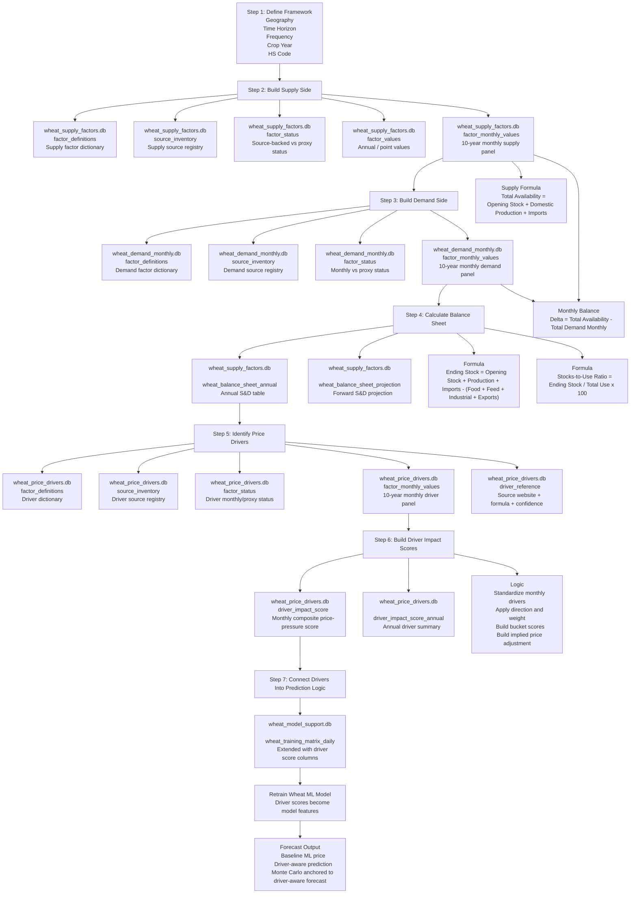

# Wheat S&D Flow: Step 1 to Step 7

```mermaid
flowchart TD
    S1["Step 1: Define Framework
    Geography
    Time Horizon
    Frequency
    Crop Year
    HS Code"] --> S2["Step 2: Build Supply Side"]

    S2 --> T21["wheat_supply_factors.db
    factor_definitions
    Supply factor dictionary"]
    S2 --> T22["wheat_supply_factors.db
    source_inventory
    Supply source registry"]
    S2 --> T23["wheat_supply_factors.db
    factor_status
    Source-backed vs proxy status"]
    S2 --> T24["wheat_supply_factors.db
    factor_values
    Annual / point values"]
    S2 --> T25["wheat_supply_factors.db
    factor_monthly_values
    10-year monthly supply panel"]

    T25 --> S3["Step 3: Build Demand Side"]

    S3 --> T31["wheat_demand_monthly.db
    factor_definitions
    Demand factor dictionary"]
    S3 --> T32["wheat_demand_monthly.db
    source_inventory
    Demand source registry"]
    S3 --> T33["wheat_demand_monthly.db
    factor_status
    Monthly vs proxy status"]
    S3 --> T34["wheat_demand_monthly.db
    factor_monthly_values
    10-year monthly demand panel"]

    T34 --> S4["Step 4: Calculate Balance Sheet"]

    S4 --> T41["wheat_supply_factors.db
    wheat_balance_sheet_annual
    Annual S&D table"]
    S4 --> T42["wheat_supply_factors.db
    wheat_balance_sheet_projection
    Forward S&D projection"]

    S4 --> F41["Formula
    Ending Stock = Opening Stock + Production + Imports - (Food + Feed + Industrial + Exports)"]
    S4 --> F42["Formula
    Stocks-to-Use Ratio = Ending Stock / Total Use x 100"]

    T41 --> S5["Step 5: Identify Price Drivers"]

    S5 --> T51["wheat_price_drivers.db
    factor_definitions
    Driver dictionary"]
    S5 --> T52["wheat_price_drivers.db
    source_inventory
    Driver source registry"]
    S5 --> T53["wheat_price_drivers.db
    factor_status
    Driver monthly/proxy status"]
    S5 --> T54["wheat_price_drivers.db
    factor_monthly_values
    10-year monthly driver panel"]
    S5 --> T55["wheat_price_drivers.db
    driver_reference
    Source website + formula + confidence"]

    T54 --> S6["Step 6: Build Driver Impact Scores"]

    S6 --> T61["wheat_price_drivers.db
    driver_impact_score
    Monthly composite price-pressure score"]
    S6 --> T62["wheat_price_drivers.db
    driver_impact_score_annual
    Annual driver summary"]

    S6 --> F61["Logic
    Standardize monthly drivers
    Apply direction and weight
    Build bucket scores
    Build implied price adjustment"]

    T61 --> S7["Step 7: Connect Drivers Into Prediction Logic"]

    S7 --> T71["wheat_model_support.db
    wheat_training_matrix_daily
    Extended with driver score columns"]

    T71 --> M1["Retrain Wheat ML Model
    Driver scores become model features"]

    M1 --> O1["Forecast Output
    Baseline ML price
    Driver-aware prediction
    Monte Carlo anchored to driver-aware forecast"]

    T25 --> F21["Supply Formula
    Total Availability = Opening Stock + Domestic Production + Imports"]
    T25 --> F22["Monthly Balance
    Delta = Total Availability - Total Demand Monthly"]
    T34 --> F22
```
